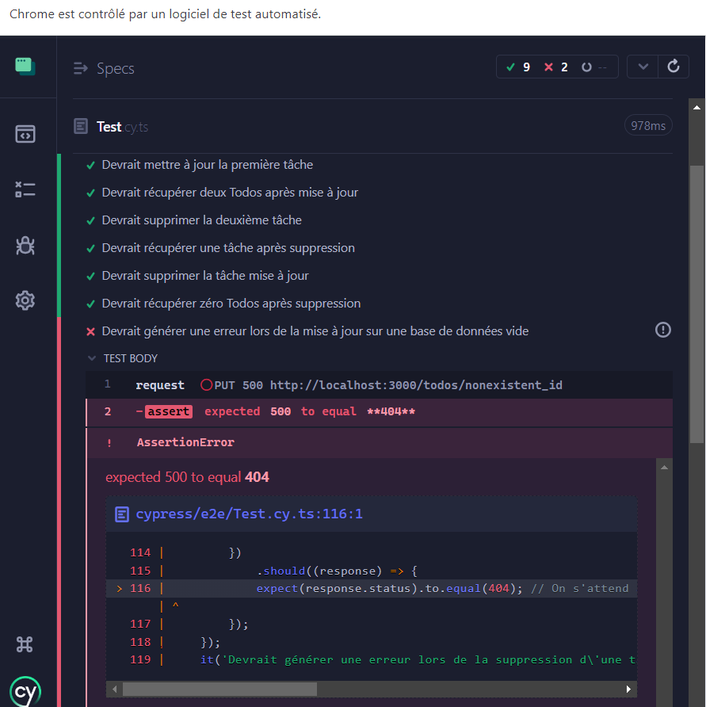

# Candidate-Qa-Test

## Introduction

Dans le cadre de ce projet, j'ai été chargé de réaliser des tests et de garantir la qualité de cette application.

## Principes de Tests ISTQB

Lors de nos tests, nous nous appuyons sur les principes fondamentaux du test logiciel conformément aux directives de l'ISTQB (International Software Testing Qualifications Board) :

1. **L'exhaustivité n'est pas possible**: Il est important de noter qu'il est impossible de tester chaque aspect de l'application. Étant donné que les ressources et le temps sont limités, il est essentiel de se concentrer sur les tests les plus pertinents en fonction de nos priorités.

2. **Concentration sur les points critiques**: Dans notre cas, les tests doivent se concentrer sur les endpoints de l'application et mettre en évidence les points faibles les plus critiques de l'application.

## Cas de Tests Réalisés : 

Pour cela, j'ai élaboré 11 cas de tests, qui se divisent comme suit :

1. Les 9 premiers cas représentent des scénarios nominaux qui ne génèrent pas d'erreur. Cela reflète la plupart des cas d'utilisation lorsque les utilisateurs utilisent l'application.

2. Les 2 derniers cas représentent des situations critiques qui ne sont pas prises en compte par l'application et génèrent des erreurs indésirables pour le client final.

J'ai fourni un rapport ([REPORT.md](REPORT.md)) des tests réalisés qui respecte deux contraintes :

1. Suffisamment technique pour que les développeurs puissent rapidement localiser la source du problème. J'ai inclus les codes de réponse tels que 200, 201, 404, 500, etc.

2. Suffisamment simple pour que les non-techniciens puissent comprendre. J'ai utilisé des termes tels que récupération, création, mise à jour et suppression au lieu de GET, POST, PUT et DELETE. J'ai également indiqué si le test a réussi ou non, de manière à ce que les développeurs puissent facilement identifier la méthode concernée.

Pour les deux derniers tests, j'ai fourni des recommandations pour résoudre les problèmes identifiés.

## Améliorations possibles de l'application :

1. Lors de la création de tâches (todos), les identifiants (ID) sont générés automatiquement, ce qui signifie que nous ne connaissons pas ces ID à l'avance. Cela limite notre capacité à effectuer certaines actions qui supposent de connaître préalablement les ID.

2. Comme le montrent et l'indiquent les tests ultérieurs, les exceptions ne sont pas prises en compte. Dans notre cas, de nombreux cas d'exception peuvent se produire, par exemple, toutes les exceptions que la base de données peut générer, ainsi que les exceptions liées à la synchronisation.

3. L'ajout d'une interface utilisateur avec des liens, des boutons, des formulaires, des listes, des cartes, etc., peut donner une autre perspective de l'application et ouvrir la porte à des tests qui mettent en évidence l'importance de Cypress.

4. L'ajout d'une fonction d'authentification peut également être intéressant, notamment si les titres des tâches peuvent contenir des informations privées, telles que des numéros de téléphone, des adresses e-mail, des salaires, ou des plans stratégiques de l'entreprise, etc.

Dans les prochaines heures, je fournirai un lien vers un autre référentiel où j'ai moi-même mis en œuvre les recommandations mentionnées dans le rapport de test pour démontrer que tous les tests vont réussir. De plus, je basculerai vers l'anglais pour les commentaires dans le code et dans le rapport après avoir effectué la vérification.

Merci.
